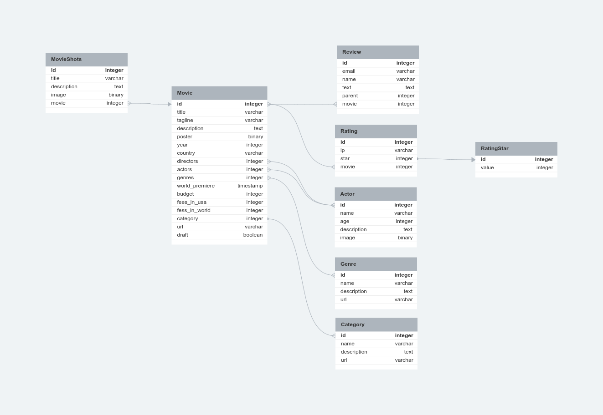

# Cinemate-api

<br/>

## Стек проекта

[](https://www.python.org/)
[](https://www.djangoproject.com/)
[](https://www.django-rest-framework.org/)
[](https://pypi.org/project/Pillow/)
[](https://pypi.org/project/django-ckeditor/)
[](https://pypi.org/project/psycopg2-binary/)
[](https://pypi.org/project/django-filter/)
[](https://pypi.org/project/djoser/)
[](https://pypi.org/project/djangorestframework-simplejwt/)
[](https://pypi.org/project/drf-yasg/)
[](https://pypi.org/project/django-rest-framework-social-oauth2/)
[](https://pypi.org/project/django-cors-headers/)
[](https://github.com/kluevevga/Cinemate-api/blob/master/LICENSE)
[](https://github.com/kluevevga/Cinemate-api)

## О проекте

REST API backend сервис для управления фильмами и отзывами. Этот проект является частью приложения "movies" и расширяет
его функциональность.

Основные особенности проекта:

- Использует базу данных PostgreSQL для хранения данных.
- Разработан с использованием фреймворка Django REST framework.
- Реализована аутентификация с использованием JWT токенов для обеспечения безопасности.
- Поддерживает рекурсивное отображение отзывов, что позволяет удобно структурировать обратные связи.
- Система сохраняет IP-адреса отправителей отзывов, что полезно для отслеживания и анализа активности пользователей.

Также в репозитории проекта находится копия тестовой базы данных в файле "movies.postgres.bak", что упрощает
развертывание и восстановление данных при необходимости.

## Установка

Для начала, склонируйте проект на свой компьютер:

```shell
git clone https://github.com/kluevevga/Cinemate-api.git
```

Перейдите в папку с проектом:

```shell
cd Cinemate-api
```

После этого, создайте виртуальное окружение:

```shell
python3 -m venv env
```

Активируйте виртуальное окружение:

Для Windows(power shell):

```shell
.\venv\Scripts\activate
```

Для macOS и Linux и windows(git bash):

```shell
source env/bin/activate
```

Установите зависимости, необходимые для проекта:

```shell
pip install -r requirements.txt
```

## Запуск development сервера

Выполните миграции для базы данных:

```shell
python manage.py migrate
```

Запустите сервер:

```shell
python manage.py runserver
```

## End-points documentation

После установки сервера документация доступна по адресу:

```
swagger/
```

```
redoc/
```

## База Данных

1. Категории

```
1. имя - Char
2. описание - Text
3. url - Slug
```

2. Фильмы

```
1. название - Char
2. слоган - Char
3. описание - Text
4. постер - Image
5. год - Date
6. страна - Char
7. режиссер - M2M
8. актеры - M2M
9. жанр - M2M
10. премьера в мире - Char
11. бюджет - Char
12. сборы в США - Char
13. сборы в мире - Char
14. категория - FK 
15. url - Slug
16. черновик - Bool
```

3. Кадры из фильма

```
1. название - Char
2. описание - Text
3. изображение - Image
4. фильм - FK
```

4. Режиссеры\\Актеры

```
1. имя - Char
2. возраст - Int
3. описание - Text
4. изображение - Image
```

5. Звезды рейтинга

```
1. значение - Int
```

6. рейтинг

```
1. ip - IP
2. звезда - FK
3. фильм - FK
```

7. отзывы

```
1. email - Email
2. name - Char
3. text - Text
4. родитель (кому ответили)
5. фильм - FK

```

8. Жанры

```
1. имя - Char
2. описание - Text
3. url - Slug
```

## Схемма базы данных



## Лицензия 📜

Этот проект распространяется под лицензией `MIT`. Дополнительную информацию можно найти
в [LICENSE](https://github.com/kluevevga/Cinemate-api/blob/master/LICENSE).